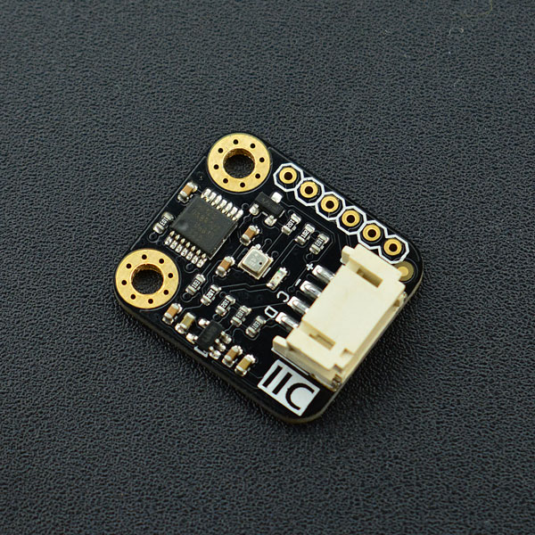

# DFRobot_BME280
* [中文版](./README_CN.md)

BME280 is an environmental sensor that integrates onboard temperature sensor, humidity sensor and barometer. The sensor has high precision, multiple functions, and a small form factor. It provides both SPI and I2C interfaces, which make it easy to make fast prototypes. It can be widely used in environmental monitoring, story height measurement, Internet of Things (IoT) control and other various enviroment related ideas! Tge Gravity I2C BME280 Environmental Sensor has based on BoSCH's newest MEMS sensor (Micro-Electro-Mechanical System). It is very stable when compared with similar sensors. The sensor is especially adept in air pressure measurement; it has an offset temperature coefficient of ±1.5 Pa/K, equiv. to ±12.6 cm at 1 °C temperature change. Therefore, the stable and multi-function form of the BME280 can be a perfect fit in many scenarios.




## Product Link (https://www.dfrobot.com/product-1606.html)
    SKU: SEN0236


## Table of Contents

* [Installation](#installation)
* [Methods](#methods)
* [Compatibility](#compatibility)
* [History](#history)
* [Credits](#credits)


## Summary

- Compatible with 3.3V/5V microcontrollers
- Environmental monitoring: temperature, humidity and barometer
- Gravity I2C interface and reserve XH2.54 SPI interface
- Small size, convenient to install


## Installation

There two methods:

1. To use this library, first download the library file, paste it into the \Arduino\libraries directory, then open the examples folder and run the demo in the folder.
2. Search the DFRobot_BME280 library from the Arduino Software Library Manager and download it.


## Methods

```C++

  /**
   * @fn DFRobot_BME280
   * @brief the DFRobot_BME280 class' constructor.
   * @return None
   */
  DFRobot_BME280();

  /**
   * @fn begin
   * @brief begin Sensor begin
   * @return Enum of eStatus_t
   */
  eStatus_t   begin();

  /**
   * @fn getTemperature
   * @brief getTemperature Get temperature
   * @return Temprature in Celsius
   */
  float       getTemperature();

  /**
   * @fn getPressure
   * @brief getPressure Get pressure
   * @return Pressure in pa
   */
  uint32_t    getPressure();

  /**
   * @fn getHumidity
   * @brief getHumidity Get humidity
   * @return Humidity in percent
   */
  float       getHumidity();

  /**
   * @fn calAltitude
   * @brief calAltitude Calculate altitude
   * @param seaLevelPressure Sea level pressure
   * @param pressure Pressure in pa
   * @return Altitude in meter
   */
  float       calAltitude(float seaLevelPressure, uint32_t pressure);

  /**
   * @fn reset
   * @brief reset Reset sensor
   */
  void    reset();

  /**
   * @fn setCtrlMeasMode
   * @brief setCtrlMeasMode Set control measure mode
   * @param eMode One enum of eCtrlMeasMode_t
   */
  void    setCtrlMeasMode(eCtrlMeasMode_t eMode);

  /**
   * @fn setCtrlMeasSamplingTemp
   * @brief setCtrlMeasSamplingTemp Set control measure temperature oversampling
   * @param eSampling One enum of eSampling_t
   */
  void    setCtrlMeasSamplingTemp(eSampling_t eSampling);

  /**
   * @fn setCtrlMeasSamplingPress
   * @brief setCtrlMeasSamplingPress Set control measure pressure oversampling
   * @param eSampling One enum of eSampling_t
   */
  void    setCtrlMeasSamplingPress(eSampling_t eSampling);

  /**
   * @fn setCtrlHumiSampling
   * @brief setCtrlHumiSampling Set control measure humidity oversampling
   * @param eSampling One enum of eSampling_t
   */
  void    setCtrlHumiSampling(eSampling_t eSampling);

  /**
   * @fn setConfigFilter
   * @brief setConfigFilter Set config filter
   * @param eFilter One enum of eConfigFilter_t
   */
  void    setConfigFilter(eConfigFilter_t eFilter);

  /**
   * @fn setConfigTStandby
   * @brief setConfigTStandby Set config standby time
   * @param eT One enum of eConfigTStandby_t
   */
  void    setConfigTStandby(eConfigTStandby_t eT);

```


## Compatibility

MCU                | Work Well | Work Wrong | Untested  | Remarks
------------------ | :----------: | :----------: | :---------: | -----
FireBeetle-ESP32  |      √       |             |            | 
FireBeetle-ESP8266  |      √       |             |            | 
Arduino uno |       √      |             |            | 


## History

- 2022/06/16 - Version 1.0.0 released.
- 2022/09/22 - Version 1.0.1 released.
- 2022/12/02 - Version 1.0.2 released.


## Credits

Written by Frank(jiehan.guo@dfrobot.com), 2022. (Welcome to our [website](https://www.dfrobot.com/))

