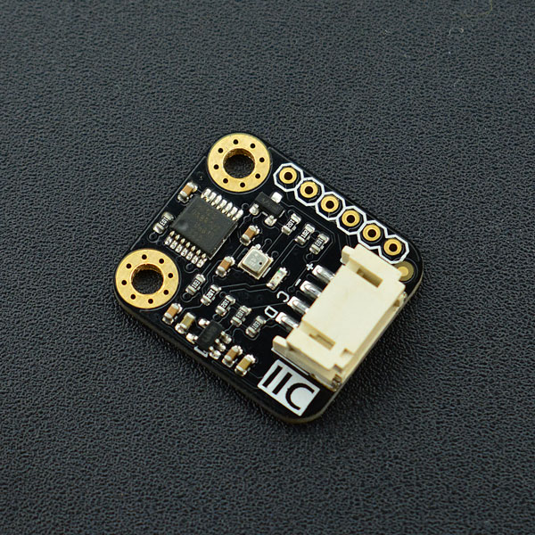

# DFRobot_BME280
* [English Version](./README.md)

BME280是一款集成温度、湿度、气压，三位一体的环境传感器。具有高精度，多功能，小尺寸等特点。DFRobot Gravity I2C BME280环境传感器采用Gravity-I2C接口设计，同时预留SPI接口，可以方便快捷的搭建产品原型，应用于环境监测，楼层高度检测，物联网控制等各种应用场景。

Gravity I2C BME280环境传感器使用BOSCH最新MEMS微机电传感器，具备良好的稳定性。气压测量在整个温区非常稳定的，偏置温度系数±1.5 pa/k，当温度变化时，1摄氏度的温度变化导致的误差仅在12.6厘米。这种稳定性，连同其多功能的特点，使得BME280可以适用于各种应用场景。




## 产品链接 (https://www.dfrobot.com.cn/goods-1410.html)
    SKU: SEN0236


## 目录

* [概述](#概述)
* [库安装](#库安装)
* [方法](#方法)
* [兼容性](#兼容性)
* [历史](#历史)
* [创作者](#创作者)


## 概述

- 宽电压输入，兼容3.3V/5V控制器
- 温度，湿度和气压，三合一环境参数监测
- Gravity I2C接口，同时预留XH2.54 SPI接口，接口方便实用
- 小尺寸，方便安装


## 库安装

要使用库, 首先下载库文件, 将其粘贴到指定的目录中, 然后打开Examples文件夹并在该文件夹中运行演示。


## 方法

```python

    '''!
      @brief 初始化函数
      @return 返回初始化状态
      @retval True 表示初始化成功
      @retval False 表示初始化成失败
    '''
    def begin(self):

    '''!
      @brief 从寄存器获取温度测量值, 工作范围(-40 ‒ +85 °C)
      @return 返回温度测量值, 单位是℃
    '''
    @property
    def get_temperature(self):

    '''!
      @brief 从寄存器获取压力测量值, 工作范围(300‒1100 hPa)
      @return 返回压力测量值, 单位是Pa
    '''
    @property
    def get_pressure(self):

    '''!
      @brief 从寄存器获得湿度测量值，工作范围(0 ~ 100% RH)
      @return 返回湿度测量，单位:%RH
    '''
    @property
    def get_humidity(self):

    '''!
      @brief 根据传感器所测量大气压, 计算海拔高度
      @return 返回海拔高度, 单位m
      @attention 若之前提供了基准值, 则根据校准的海平面大气压, 计算当前位置海拔绝对高度
    '''
    @property
    def get_altitude(self):

    '''!
      @brief 获取数据准备（测量）状态
      @return True表示数据准备就绪
    '''
    @property
    def get_data_ready_status(self):

    '''!
      @brief 触发重置, 所有用户配置设置将被其默认状态覆盖
    '''
    def reset(self):

    '''!
      @brief 以给定的当前位置海拔做为基准值, 为后续压力和海拔数据消除绝对差
      @param altitude 当前位置海拔高度
      @return 传入基准值成功, 返回ture, 失败返回false
    '''
    def calibrated_absolute_difference(self, altitude):

    '''!
      @brief 测量模式和电源模式的配置
      @param mode 需要设置的测量模式和电源模式:
      @n       SLEEP_MODE(Sleep mode): 开机复位后默认处于休眠模式。该模式不进行任何测量, 功耗最小。所有寄存器均可访问;可以读取芯片ID和补偿系数。
      @n       FORCED_MODE(Forced mode): 在强制模式下, 根据选择的测量和滤波选项进行单个测量。测量完成后, 传感器返回睡眠模式, 测量结果可从数据寄存器中获得。
      @n       NORMAL_MODE(Normal mode): 在测量周期和待机周期之间连续循环, 输出数据率(output data rates)与ODR模式设置有关。
    '''
    def set_ctrl_meas_mode(self, mode):

    '''!
      @brief  温度测量的过采样配置(OSR:over-sampling register)
      @details 需要设置的温度测量的过采样模式
      @param osrs_t 6种温度过采样模式:
      @n       BMP3XX_TEMP_OSR_SETTINGS[0], 温度采样×0, Skipped (output set to 0x80000)
      @n       BMP3XX_TEMP_OSR_SETTINGS[1], 温度采样×2, 16 bit 
      @n       BMP3XX_TEMP_OSR_SETTINGS[2], 温度采样×4, 18 bit 
      @n       BMP3XX_TEMP_OSR_SETTINGS[3], 温度采样×8, 19 bit 
      @n       BMP3XX_TEMP_OSR_SETTINGS[4], 温度采样×16, 20 bit 
      @n       BMP3XX_TEMP_OSR_SETTINGS[5], 温度采样×32, 21 bit 
    '''
    def set_ctrl_meas_sampling_temp(self, osrs_t):

    '''!
      @brief  压力测量的过采样配置(OSR:over-sampling register)
      @details 需要设置的压力测量的过采样模式
      @param osrs_t 6种压力过采样模式:
      @n       BME280_PRESS_OSR_SETTINGS[0], 压力采样×0, Skipped (output set to 0x80000)
      @n       BME280_PRESS_OSR_SETTINGS[1], 压力采样×2, 16 bit 
      @n       BME280_PRESS_OSR_SETTINGS[2], 压力采样×4, 18 bit 
      @n       BME280_PRESS_OSR_SETTINGS[3], 压力采样×8, 19 bit 
      @n       BME280_PRESS_OSR_SETTINGS[4], 压力采样×16, 20 bit 
      @n       BME280_PRESS_OSR_SETTINGS[5], 压力采样×32, 21 bit 
    '''
    def set_ctrl_meas_sampling_press(self, osrs_p):

    '''!
      @brief  湿度测量的过采样配置(OSR:over-sampling register)
      @details 需要设置的湿度测量的过采样模式
      @param osrs_h 6种湿度过采样模式:
      @n       BME280_HUMI_OSR_SETTINGS[0], 湿度采样×0, Skipped (output set to 0x80000)
      @n       BME280_HUMI_OSR_SETTINGS[1], 湿度采样×2, 16 bit 
      @n       BME280_HUMI_OSR_SETTINGS[2], 湿度采样×4, 18 bit 
      @n       BME280_HUMI_OSR_SETTINGS[3], 湿度采样×8, 19 bit 
      @n       BME280_HUMI_OSR_SETTINGS[4], 湿度采样×16, 20 bit 
      @n       BME280_HUMI_OSR_SETTINGS[5], 湿度采样×32, 21 bit 
    '''
    def set_ctrl_sampling_humi(self, osrs_h):

    '''!
      @brief IIR滤波系数配置(IIR filtering)
      @param iir_config_coef IIR滤波系数设置, 可配置模式: 
      @n         BME280_IIR_FILTER_SETTINGS[0], 滤波器 关
      @n         BME280_IIR_FILTER_SETTINGS[1], 滤波器 系数 2
      @n         BME280_IIR_FILTER_SETTINGS[2], 滤波器 系数 4
      @n         BME280_IIR_FILTER_SETTINGS[3], 滤波器 系数 8
      @n         BME280_IIR_FILTER_SETTINGS[4], 滤波器 系数 16
    '''
    def set_config_filter(self, iir_config_coef):

    '''!
      @brief 细分/二次采样的方式设置输出数据率配置(ODR:output data rates)
      @param odr_set 需要设置的输出数据率,可配置模式: 
      @n BME280_CONFIG_STANDBY_TIME_0P5, BME280_CONFIG_STANDBY_TIME_62P5,  BME280_CONFIG_STANDBY_TIME_125, 
      @n BME280_CONFIG_STANDBY_TIME_250, BME280_CONFIG_STANDBY_TIME_500,  BME280_CONFIG_STANDBY_TIME_1000, 
      @n BME280_CONFIG_STANDBY_TIME_10, BME280_CONFIG_STANDBY_TIME_20
      @return  返回配置结果
      @retval True 表示配置成功
      @retval False 表示配置失败, 保持原来的配置
    '''
    def set_config_T_standby(self, odr_set):

```


## 兼容性

* RaspberryPi 版本

| Board        | Work Well | Work Wrong | Untested | Remarks |
| ------------ | :-------: | :--------: | :------: | ------- |
| RaspberryPi2 |           |            |    √     |         |
| RaspberryPi3 |           |            |    √     |         |
| RaspberryPi4 |     √     |            |          |         |

* Python 版本

| Python  | Work Well | Work Wrong | Untested | Remarks |
| ------- | :-------: | :--------: | :------: | ------- |
| Python2 |     √     |            |          |         |
| Python3 |     √     |            |          |         |


## 历史

- 2022/06/16 - 1.0.0 版本
- 2022/09/22 - 1.0.1 版本


## 创作者

Written by qsjhyy(yihuan.huang@dfrobot.com), 2022. (Welcome to our [website](https://www.dfrobot.com/))

